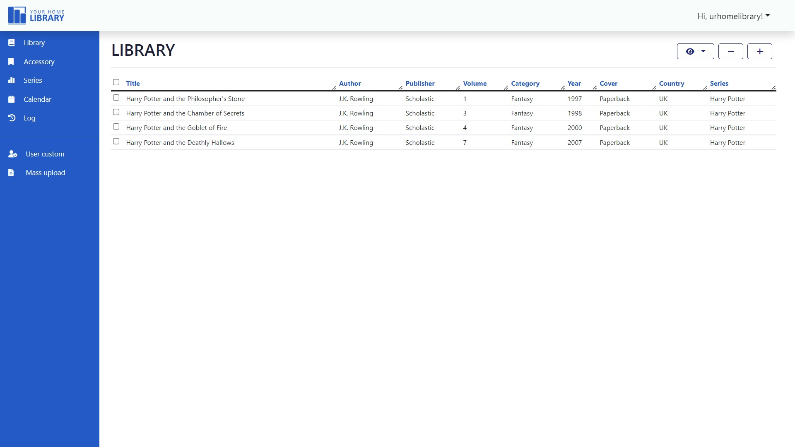
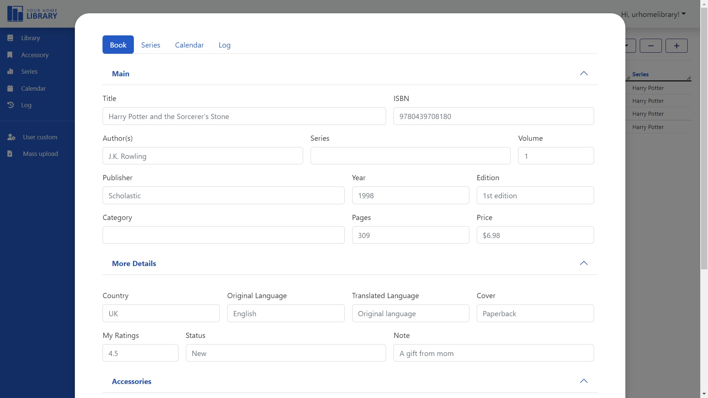
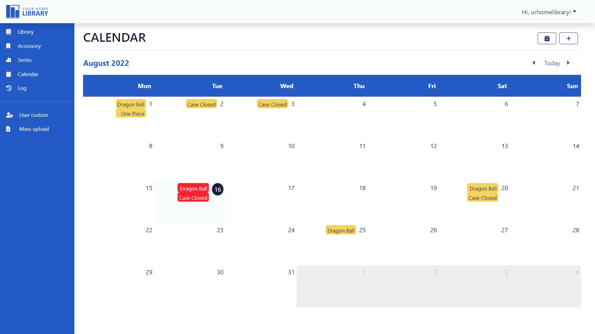

# YOUR HOME LIBRARY


## About

This is the final project for CS50 Introduction to Computer Science by Havard University. The concept is a website to
manage your book collection, focused on series tracker. It was inspired by my big bookshelves of which more than half
are manga series. It's hard to find the missing volumes if I forgot to buy, even for a short time. So my first idea was
to create a tool to keep tracking and automatically update the current book series status.

### Demo
#### [Video](https://youtu.be/JIrX1scqqEw)





### References

- CS50 lessons and problem sets.
- W3schools.
- CSS-tricks tutorials.
- StackOverflow.

### Libraries, frameworks and engines

- Flask for web server development Werkzeug for security and Jinja for templates engine.
- CS50 for simple built-in SQL functions.
- SQLite for database management.
- Dayjs for date format.
- Bootstrap, FontAwesome for front-end designing.
- And 1 line of jQuery to activate Bootstrap tooltips.

### Languages

Python, Javascript, SQL, HTML, SASS.

### Other

Canva templates for designing banners.\
Lovo.ai for the video demo's voiceover.

## Build and run

### Requirements

Make sure your computer have installed and activated **python3.10** or above, **pip**, **venv**, **nodejs**.

### Clone

Clone this repository to your local computer.

```shell script
$ git clone https://github.com/hytnht/ur-home-lib.git
$ cd ur-hone-lib
```

### Configuration

Create and activate virtualenv:

```shell script
$ python3 -m venv venv
source .venv/bin/activate
```

Create environment variables `env.py`:

```shell script
$ touch env.py
```

Assign your email and passwords to variables in file `env.py`:

```python
import os


def setVar():
    os.environ['MAIL_USERNAME'] = 'your_email'
    os.environ['MAIL_PASSWORD'] = 'password'
    os.environ['MAIL_DEFAULT_SENDER'] = 'your_email'
```

### Install dependencies

Install python requirements in root folder:

```shell script
$ python3 -m pip install -r requirements.tx
```

Instal **nodejs** package in `static` folder:

```shell script
$ cd static
$ npm install
```

### Compile SCSS:

Compile `scss` to `css` stylesheet:

```shell script
$ sass --watch style.scss style.css
```

### Create database

Go back to root folder and create table using **sqlite3**:

```shell script
$ sqlite3 database.db < create.sql
```

### Run

Run project using Flask in root folder:

```shell script
$ flask run 
```


